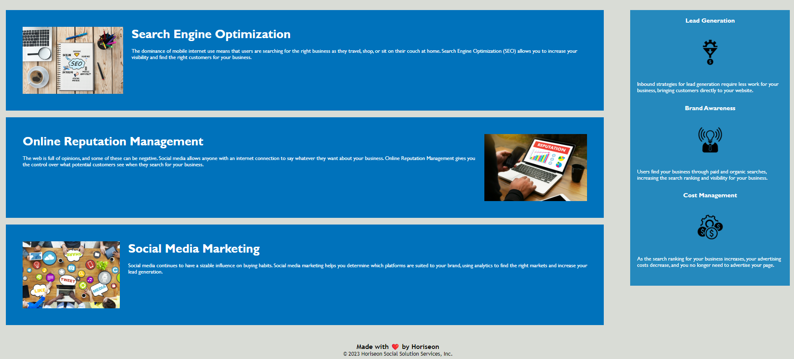

# Horiseon-Refactor-Home-Page

## Description

Refactor of the Horiseon site Home Page to allow for more accessibility and optimize the site for search engines.
The codebase was updated to follow semantic HTML elements and to follow a more logical structure.
A few simple fixes allowed the HTML and CSS to flow easier and be understood by future developers.

## Installation

Open page using URL: https://natalieyaspo.github.io/Horiseon-Refactor-Home-Page/

## Usage

The Home Page should look like the following:

## License

None Required